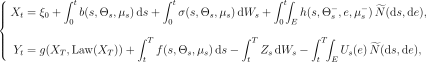

# Well-posedness of Fully Coupled McKean–Vlasov FBSDEs with Jumps under Full-Tuple Law Dependence

[](https://arxiv.org/abs/2608.23203)
[](https://github.com/cgarryZA/mv-fbsdej-well-posedness/actions/workflows/paper-formats.yml)

**Chunrong Feng and Christian Garry** · Department of Mathematical Sciences, Durham University

📄 **[Read the paper (PDF)](mvfbsdej-wellposedness.pdf)** · [arXiv:2608.23203](https://arxiv.org/abs/2608.23203)

---

<picture>
  <source media="(prefers-color-scheme: dark)" srcset="assets/abstract-dark.svg">
  
</picture>

---

## The system

<picture>
  <source media="(prefers-color-scheme: dark)" srcset="assets/system-dark.svg">
  
</picture>

The system is driven by a Brownian motion W and an independent compensated Poisson random
measure Ñ. Writing its solution tuple as Θ = (X, Y, Z, U), the time-dependent coefficients
are evaluated along the joint law flow μₜ = Law(Θₜ).

**The distinguishing feature is the law argument.** The coefficients are Lipschitz with
respect to the quadratic Wasserstein distance W₂ on 𝒫₂(ℋ), where
ℋ = ℝⁿ × ℝᵐ × ℝᵐˣᵈ × L²(ν; ℝᵐ). Thus the coefficients may depend on the law of the
L²(ν)-valued jump integrand U itself. The intensity measure ν is assumed only to be
σ-finite; it need not have finite total mass, so infinite jump activity is admitted.

## Main results

| Result | Statement |
| --- | --- |
| **Theorem 3.1** | *Stability.* The distance between two solutions is controlled by the corresponding differences in their coefficients and data. The constant depends only on T, the Lipschitz and monotonicity data, and the relevant BDG constant — not on n, m, d, or ν(E). |
| **Theorem 3.3** | *Uniqueness* in the natural solution class. |
| **Theorem 3.5** | *Global well-posedness.* For **every** horizon T > 0 and with **no smallness restriction on the coupling**, the system has a unique solution depending continuously on the coefficients and data. Proved by monotone continuation in the coupling strength from a small-coupling base case. |
| **Corollary 3.6** | *Robustness.* Well-posedness is preserved under full-tuple-law perturbations smaller than the dissipativity margin. |
| **Proposition 3.8** | *Strictness.* Expected diagonal G-monotonicity is **strictly weaker** than its pointwise form — the diagonal restriction is a genuine weakening, not a reformulation. |

## What is new

The closest comparison is Li and Min's well-posedness theorem for fully coupled mean-field
FBSDEs with jumps. In their setting, the mean-field interaction is expressed through
expectation functionals of an independent copy, dependence on the jump integrand is
pointwise in the mark variable, and the assumptions require finite total jump mass. The
scope of the present result can be summarised in three points:

* **Full-tuple law dependence.** The coefficients may depend in W₂ on the joint law of (X, Y, Z, U), including U as an L²(ν)-valued random variable.
* **Arbitrary jump activity.** The intensity may be any σ-finite measure; in particular, ν(E) may be infinite.
* **Unrestricted coupling strength.** No smallness condition is imposed on the coupling; dissipativity is supplied by the monotonicity structure.

Example 5.5 gives a mean-field dealer-market model whose jump coefficient depends on the
law of U. A population law of valuation curves enters the jump response through a monotone
crowding operator; the resulting interaction remains monotone at every interaction
strength, while the mark measure has infinite activity.

---

## Repository structure

| Path | Contents |
| --- | --- |
| `mvfbsdej-wellposedness.pdf` | Current compiled manuscript |
| `paper/wellposedness.tex` | Canonical master: preamble, title, abstract, section inputs |
| `paper/wellposedness_spa.tex` | SPA-format master built from the same section files |
| `paper/sections/` | Body of the paper, one file per section, with an embedded bibliography |
| `paper/references.bib` | Structured bibliography export, checked against the embedded `thebibliography` |
| `paper/wellposedness-arxiv-abstract.txt` | Generated, MathJax-safe arXiv metadata abstract |
| `assets/` | README artwork, regenerated from the manuscript by `scripts/make_readme_svg.sh` |
| `submissions/` | Frozen arXiv and SPA submission artefacts |

## Build

```bash
cd paper
latexmk -pdf wellposedness.tex
latexmk -pdf wellposedness_spa.tex
```

The bibliography is embedded, so no BibTeX or Biber pass is required. Building the canonical
master refreshes the root manuscript PDF and regenerates the arXiv metadata abstract.

## Package submissions

```bash
bash scripts/make_arxiv_tarball.sh
bash scripts/make_spa_submission.sh
```

Each packaging script flattens its master with `latexpand`, rejects any surviving comments,
compiles the flattened manuscript independently, and only then writes the archive. Run both
after changing `paper/` so the committed archives stay synchronised with the manuscript.

## Checks

```bash
python3 scripts/check_bib_sync.py
python3 scripts/check_paper_formats.py paper/wellposedness.aux paper/wellposedness_spa.aux
bash scripts/make_readme_svg.sh
```

These commands check that `references.bib` agrees with the embedded bibliography, compare
the label-to-number mapping each format records for the paper's own statements, and regenerate the abstract and governing system directly from `paper/`. Run
the artwork command whenever either changes. The first two also run on every push via
[`.github/workflows/paper-formats.yml`](.github/workflows/paper-formats.yml).

## Citation

Please cite the paper using GitHub's **Cite this repository** menu or
[`CITATION.cff`](CITATION.cff).

## Licensing

The build, packaging and checking scripts under `scripts/` and the workflow
under `.github/` are MIT (`LICENSE`).

The manuscript is not (`LICENSE-PAPER`): everything under `paper/` and
`submissions/`, the compiled PDF, and the figures generated from them are
Copyright (c) 2026 Chunrong Feng and Christian Garry, all rights reserved.
